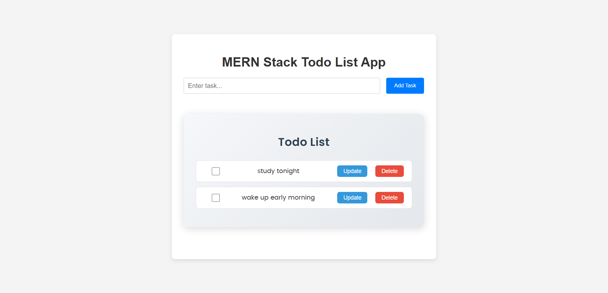

# 📋 MERN-TodoList-App


**MERN-TodoList-App** is a full-stack web application built using the MERN stack (MongoDB, Express.js, React, Node.js). It allows users to manage their tasks by adding, updating, and deleting todos, with data persistently stored in a MongoDB database. The frontend is created using Create React App, providing a responsive and interactive user interface, while the backend handles API requests and database operations.

## 🚀 Features

### 📋 Task Management

- Add, update, and delete tasks seamlessly.
- View a list of all tasks with their statuses.

### 🌐 Full-Stack Integration

- Frontend communicates with the backend via RESTful APIs.
- Backend handles CRUD operations with MongoDB.

### 📱 Responsive Design

- Adapts to different screen sizes for a consistent experience.
- Ensures usability on both desktop and mobile devices.

### 💾 Persistent Storage

- Tasks are stored in MongoDB for data persistence.
- Ensures tasks are retained across sessions.

## 🛠️ Tech Stack

- **Frontend**: React, JavaScript, CSS
- **Backend**: Node.js, Express.js
- **Database**: MongoDB

---

## 📸 Screenshots

Below are some screenshots showcasing the **MERN-TodoList-App** interface:



---

## 📽️ Project Demo

Below is the project demo video of the **MERN-TodoList-App** interface:

[Project Demo Video](https://jmp.sh/fa0kA9ig)

---

## 📂 Project Structure

```
mern-todolist-app/
   ├── backend/                # Backend Node.js/Express application (see Backend README)
   ├── frontend/               # Frontend React application (see Frontend README)
   ├── .gitignore              # Git ignore file
   ├── LICENSE                 # MIT License file
   ├── package.json            # Backend dependencies
   ├── package-lock.json       # Backend dependency lock file
   └── README.md               # Main project documentation
```

## 🧪 Installation & Setup

### 📋 Prerequisites

- Node.js (v14 or higher)
- npm or yarn
- MongoDB (local installation or MongoDB Atlas)
- Thunderclient API (for API endpoints testing)

### 🧑‍💻 Steps to run

1. **Clone the repository**

   ```bash
   git clone https://github.com/Preveen369/mern-todolist-app.git
   cd mern-todolist-app
   ```

2. **Set up the backend**

   - Follow the instructions in the [Backend README](./backend/README.md) to set up and run the backend server.

3. **Set up the frontend**

   - Follow the instructions in the [Frontend README](./frontend/README.md)  to set up and run the frontend application.

## 🤝 Contributing

Pull requests are welcome! Feel free to fork the repository and suggest improvements. For detailed contribution steps, see the Backend README or Frontend README for component-specific contributions.

## 📧 Contact

For queries or suggestions:

- 📩 Email: spreveen123@gmail.com
- 🌐 LinkedIn: www.linkedin.com/in/preveen-s-17250529b/

## 🌟 Show Your Support

If you like this project, please consider giving it a ⭐ on GitHub!
